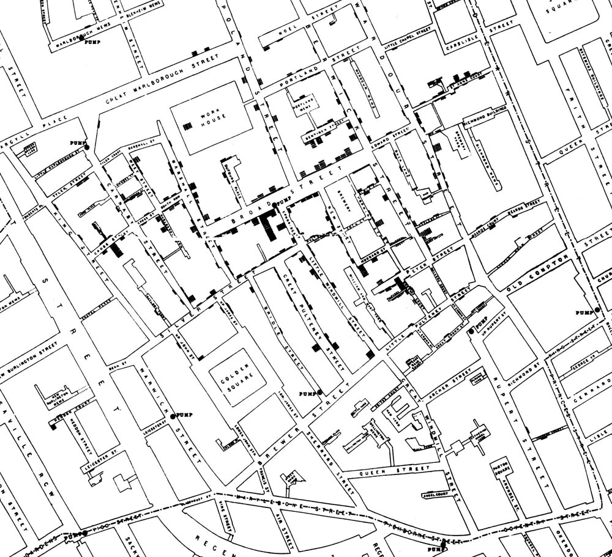

```{r setup, include=FALSE}
rm(list=ls())
library(tidyverse)
library(qss)
library(pander)

options(xtable.comment = FALSE)
theme_set(theme_bw())
def.chunk.hook  <- knitr::knit_hooks$get("chunk")
knitr::knit_hooks$set(chunk = function(x, options) {
  x <- def.chunk.hook(x, options)
  ifelse(options$size != "normalsize", paste0("\\", options$size,"\n\n", x, "\n\n \\normalsize"), x)
})
knitr::opts_chunk$set(warning=FALSE, message=FALSE, tidy = TRUE, size = "tiny")
```

## Network data

- Network data captures relationships between people, groups, families, or any set of nodes
- It is unlike typical unit-variable data we have been working with
- Network analysis is a powerful tool in criminology: criminal relationships, policy diffusion, policing practices as partner relations...

## Analyzing network data in R

```{r}
library(igraph)
library(GGally)
library(network)
## load data
data(florentine)
## set row names from variable
row.names(florentine)<-florentine$FAMILY
## drop family variable
florentine<-florentine %>% 
  select(-FAMILY)
```

## Adjacency matrix: undirected

- An adjacency matrix captures the presence or absence of ties across units.
- Directed networks have direction, with senders and receivers of ties
- Undirected networks do not have direction, they simply indicate the presence of ties

```{r}
florentine<-as.matrix(florentine)
florentine[1:6,1:6]
florence<-graph.adjacency(florentine, 
                            mode = "undirected",
                            diag = FALSE)
```

## Visualizing a network graph

```{r}
plot(florence)
```

## Quantifying network graphs: centrality

How connected is each node to each other node?

- Degree: the number of ties to each node

```{r}
degree(florence)
```

- Farness: how far is each node from each other node in the graph
- Closeness: How close, on average, is each node to each other node: $\frac{1}{farness}$

```{r}
closeness(florence)
```

## Degree

```{r echo = FALSE}
barplot(sort(degree(florence)), las=2)
```

## Closeness

```{r}
plot(florence, vertex.size = closeness(florence) * 1000)
```

## Betweeness: Does a node connect other nodes?

```{r}
plot(florence, vertex.size = betweenness(florence))
```

## Directed networks: Twitter

Twitter networks have direction: followers, followed

```{r}
data("twitter.following")
data("twitter.senator")

twitter.following<-graph.edgelist(as.matrix(
    twitter.following))

twitter.following[1:5,1:5]
```

## Visualizing a directed network

This is not a great visual...

```{r echo = FALSE}
plot(twitter.following, vertex.label = NA, vertex.size=4,
     rescale= FALSE,
     edge.arrow.size=0.2)
```

## Add degree counts to profiles

```{r}
twitter.senator <- twitter.senator %>% 
  mutate(indegree = igraph::degree(twitter.following, mode = "in"),
         outdegree = igraph::degree(twitter.following, mode = "out"))

head(twitter.senator)
```

## Centrality measures: indegree

How many ties/edges come to a node?

```{r}
head(arrange(twitter.senator, desc(indegree)))
head(arrange(twitter.senator, indegree))
```

## Centrality measures: outdegree

How many ties/edges come from a node?

```{r}
head(arrange(twitter.senator, desc(outdegree)))
head(arrange(twitter.senator, outdegree))
```

## Next steps

- Networks data can be used in regression: what predicts being well-connected? Do well connected have more X than poorly connected?
- Potential outcomes: degree, betweenness, closeness
- Just scratching the surface!

## Spatial data



## Understanding spatial data

Place can (generally) be measured two ways:

- By points (latitude, longitude)
- By shape (polygon)

## Why use spatial data

- Clusters and patterns may become apparent on a map
- Unordered plotting will miss geographic patterns
- Map making is generally a good idea when working with spatial data

## The structure of spatial data

```{r}
library(maps)
data(us.cities)
head(us.cities)
```

## What the cities data contain

```{r}
ggplot(us.cities, aes(x=long, y=lat)) + geom_point()
```

## A USA map shape file

```{r fig.height = 3}
usa_map<-map_data("usa")
head(usa_map)
ggplot(usa_map, aes(x=long, y=lat)) + geom_point()
```

## Treating this as a polygon

```{r}
nrow(usa_map)
ggplot(usa_map, aes(x=long, y=lat)) + geom_polygon()
```

## Remove AK, HI and scale by size

```{r}
ggplot() +
  geom_polygon(data=usa_map,
               aes(x=long, y = lat, group = group), 
               fill = "white", color = "black") +
  geom_point(aes(x=long, y=lat, size = pop/1e6), data=us.cities %>% 
               filter(!(country.etc%in%c("AK", "HI"))))
```

## Add states

```{r}
us_states<-map_data("state")
ggplot(us_states,
       aes(x = long, y = lat, group = group))+
  geom_polygon(color = "black", fill = "white") 
```

## Add a fill

```{r}
ggplot(us_states,
       aes(x = long, y = lat, group = group, fill = region))+
  geom_polygon(color = "black") +
  guides(fill=FALSE)
```

## Add election data

```{r}
data(pres08)
head(pres08)
head(us_states)
```

How can we join these two data frames?

## Joining

```{r}
## rename and mutate joining variable
pres08<-pres08 %>% 
  mutate(region = tolower(state.name))

us_states<-us_states %>% 
  left_join(pres08)

head(us_states)
```

## Make Obama vote share the fill color

```{r}
ggplot(us_states,
       aes(x = long, y = lat, group = group, fill = Obama))+
  geom_polygon(color = "grey50") 
```

## Make Obama vote share the fill color: remove junk

```{r}
ggplot(us_states,
       aes(x = long, y = lat, group = group, fill = Obama))+
  geom_polygon(color = "black") +
  theme_void()
```

## Make Obama vote share the fill color: remove junk

```{r}
ggplot(us_states,
       aes(x = long, y = lat, group = group, fill = Obama))+
  geom_polygon(color = "black") +
  theme_void()
```

## Vote share as diverging gradient
```{r}
us_states$obama_margin<-us_states$Obama-50
ggplot(us_states,
       aes(x = long, y = lat, group = group, fill = obama_margin))+
  geom_polygon(color = "grey50") +
  scale_fill_gradient2() +
  theme_void()
```

## Make it prettier - Albers projection, title and subtitle

```{r}
library(mapproj)
ggplot(us_states,
       aes(x = long, y = lat, group = group, fill = obama_margin))+
  geom_polygon(color = "black") +
  scale_fill_gradient2() +
  theme_void() + 
  coord_map(projection = "albers", lat0=39, lat1=45) +
  labs(title = "US Election results 2008",
       subtitle = "Barack Obama margin of victory",
       fill = "")
```

## Housekeeping

- No office hours on Friday this week, I'll have extra office hours on Monday 10-2PM
- Bring homework questions to lab today
- Question 5.5.3 you can choose to either animate or facet based on your preferences. I generally go with a facet
- When instructed to write a loop on the homework, you often don't need to. See Arnold for examples


